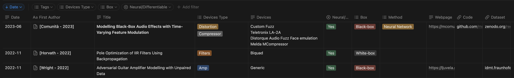
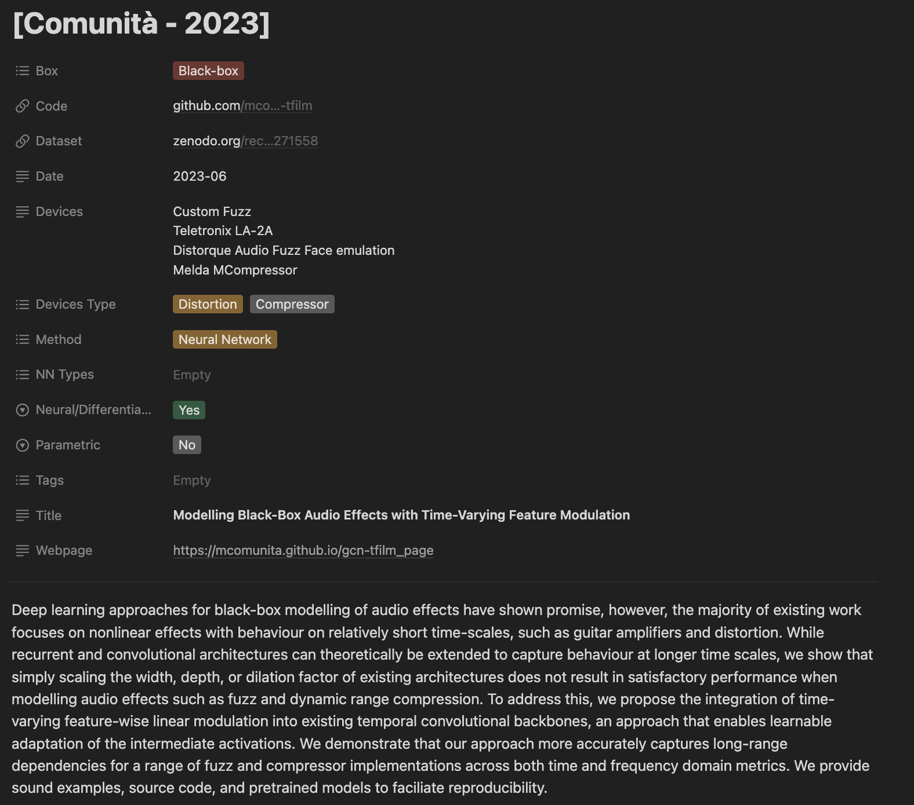

# Audio Effects Literature

#### **Scientific literature about Audio Effects**

[Marco Comunità](https://mcomunita.github.io/)

Centre for Digital Music, Queen Mary University of London, UK 

---
## Project

This repo is used to manage a database of scientific literature hosted at:

[https://mcomunita.github.io/audio-effects-literature](https://mcomunita.github.io/audio-effects-literature)

please note the link will redirect you to a Notion :tm: web page

I chose to use Notion :tm: since it allows to visualize a dynamic table with filtering, ordering, tagging options. It's also easy to update when new literature comes out.

The papers are on topics like:

- audio effects modelling
- audio effects removal
- audio effects circuits emulation
- differentiable and non-differentiable methods
- white-, gray- and black-box approaches to audio effects modelling
- approaches based on: neural networks, differentiable digital signal processing, waveshaping, wave digital filters, dynamic convolution, Wiener-Hammerstein models, Volterra series, State-spaces...
- literature reviews

---
## Contributions

We invite anyone to contribute to this collection by submitting a new issue for each publication you would like to include.

Here is an example of table entry:

 

To signal a publication, simply open a new issue including as much info as possible about it:
[*] = required

- [*] Link: URL to the publication
- [*] Date: in the YYYY-MM format
- [*] First Author: in the format [Surname - YYYY]. If more than one publication in the same year add a letter (e.g., [Author - 2022A], [Author - 2022B])
- [*] Title: title of the publication
- [*] Devices Type: what type of effects the publication is about (e.g., reverb, delay)
- Devices: what specific devices/circuits have been modelled (e.g., Ibanez Tube Screamer or Vacuum Tube Stage)
- [*] Neural/Differentiable: whether or not a differentiable approach was used for modelling
- Box: what paradigm(s) is the publication using (i.e., Black-, Gray-, White-box)
- Method: which methods or combination of methods is the publication based on (e.g., Neural Network, Wiener-Hammersten or State-space)
- Webpage: URL of the page associated with the publication
- Code: URL of the repo associated with the publication
- Dataset: URL of the data associated with the publication
- [*] Abstract

Here's an example of the info associated to each publication:

---
## Improvements

If you have suggestions or would like to help managing the repo feel free to reach out.
