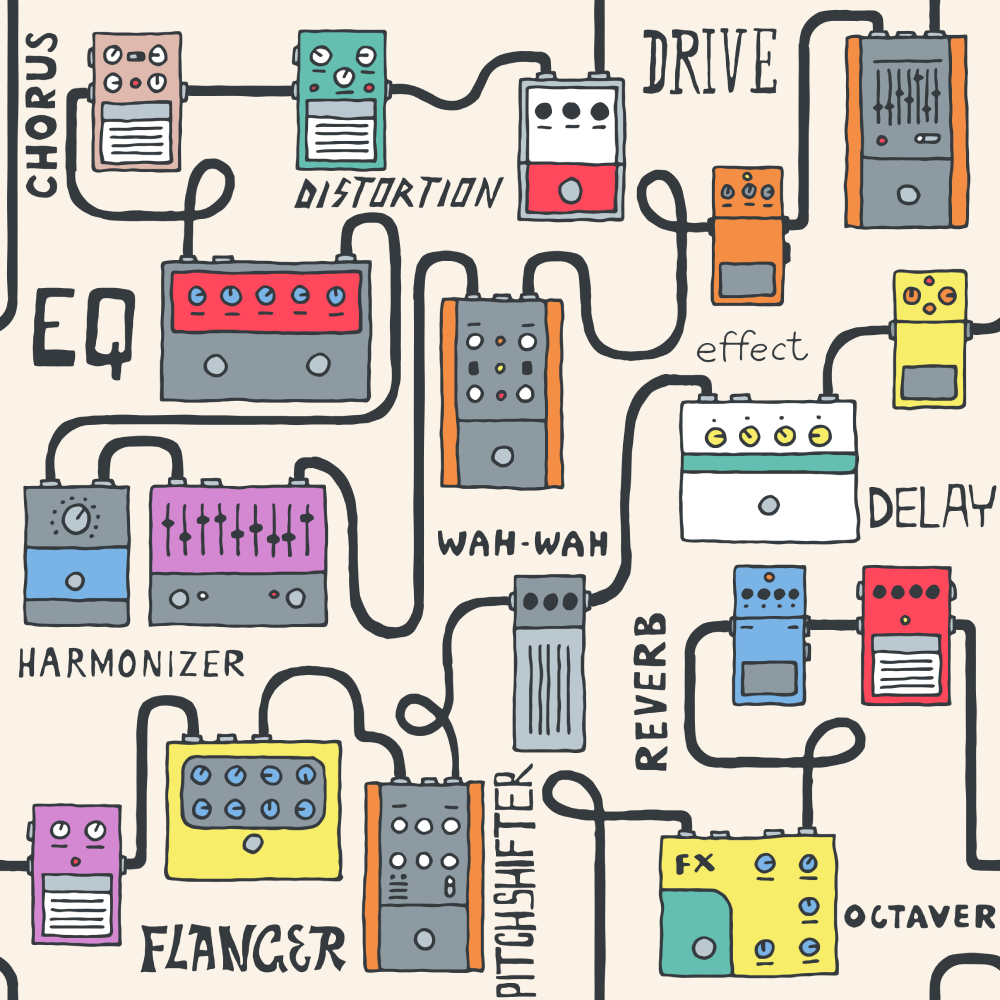
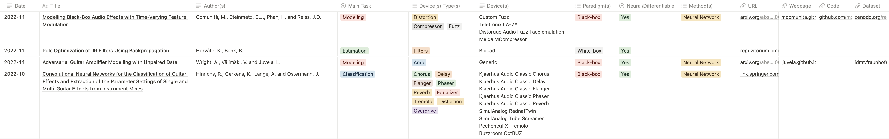

# Audio Effects Research

### **Scientific literature about Audio Effects**

[Marco Comunità](https://mcomunita.github.io/)

Centre for Digital Music, Queen Mary University of London, UK 

---
## Project

This repo is used to manage a database of scientific literature hosted at:

[https://mcomunita.github.io/AFX-Research](https://mcomunita.github.io/AFX-Research)

please note the link will redirect you to a Notion :tm: web page

I chose to use Notion :tm: since it allows to visualize a dynamic table with filtering, ordering, tagging options. It's also easy to update when new literature comes out.

The papers are on topics like:

- audio effects modelling
- audio effects classification and parameters estimation
- audio effects removal
- audio effects circuits emulation
- differentiable and non-differentiable methods
- white-, gray- and black-box approaches to audio effects modelling
- approaches based on: neural networks, differentiable digital signal processing, waveshaping, wave digital filters, dynamic convolution, Wiener-Hammerstein models, Volterra series, State-spaces...
- literature reviews

---
## Support

To show your support please consider giving this repo a star 

Thanks!

---
## Contributions

We invite anyone to contribute to this collection by submitting a new issue for each publication you would like to include.

Here is an example of table entry:

 

To signal a publication, simply open a new issue (there is a template for it) including as much info as possible about it:

[*] = required

- [*] Title: title of the publication
- [*] Author(s): author(s) of the publication
- [*] URL: URL to the publication
- [*] Date: in the YYYY-MM format
- [*] Main Task: classification, estimation, modeling, processing, removal, style transfer, review
- Paradigm(s): what paradigm(s) is the publication using (i.e., Black-, Gray-, White-box)
- [*] Device(s) Type(s): what type of effects the publication is about (e.g., reverb, delay)
- Device(s)s: what specific devices/circuits have been modelled (e.g., Ibanez Tube Screamer or Vacuum Tube Stage)
- Parametric/Controllable: Y/N - whether the publication includes some sort of controllability
- [*] Neural/Differentiable: Y/N - whether or not a differentiable approach was used
- Method: which method(s) or combination of methods is the publication based on (e.g., Neural Network, Wiener-Hammerstein or State-space)
- Webpage: URL of the page associated with the publication
- Code: URL of the repo associated with the publication
- Dataset: URL of the data associated with the publication
- [*] Abstract

Here's an example of the info associated to each publication:

---
## Improvements

If you have suggestions or would like to help managing the repo feel free to reach out.
